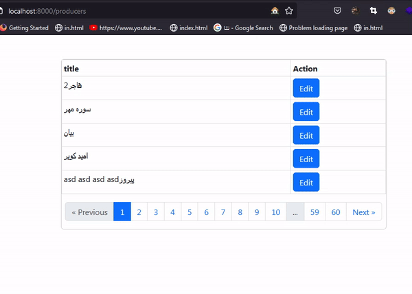

## Inertia CRUD
All modules are in `cores/` path.

## Usage
1) 
   >```composer install```
2) 
   >```php artisan migrate```
3) 
   >```php artisan serve```
4) 
   >```npm run dev```


## Modules
### Customer
<center>

</center>

### Producer
<center>

</center>
